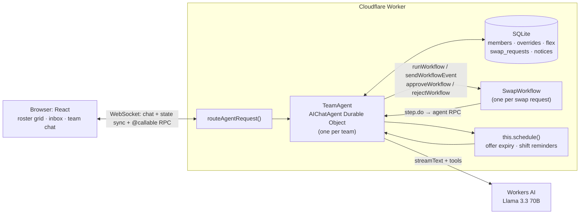

# cf_ai_shiftswap: AI shift-swap assistant on Cloudflare

**Live demo:** _deploying, link coming shortly_

A chat assistant for shift workers (nurses, techs, anyone on a rotation). You
mark days you'd pick up extra shifts, and when you need a day off you just ask:

> "Can you find someone to trade shifts with me this Friday?"

The agent works out which shift that is and finds coworkers who can legally
cover it (same role, not already working, enough rest, under the weekly cap).
It offers the shift to them with flex-available people ranked first, waits for
someone to accept, and routes it to the manager for approval. Then it
re-checks everything and updates the roster.

No sign-in: every browser gets its own demo team of seven on real rotation
patterns. Use the **Acting as** switcher to play the requester, the coworker
who accepts, and the manager.

## Try it in 60 seconds

1. Open the demo. You're **Alex (RN)**, who works this Friday.
2. In the chat, click **"Can you find someone to trade shifts with me this
   Friday?"** (or click Alex's Friday cell in the roster). The assistant offers
   the shift to Dev (marked flex for Friday, so ranked first), Ben and Hana. It
   also explains why the others were excluded: Cara would get 0h rest after her
   night shift, Eve is a Tech rather than an RN, and Finn is already working.
3. Switch **Acting as** to **Dev** and click **Accept** in the inbox.
4. Switch to **Manager** and click **Approve**. The roster updates (an orange
   outline marks a swapped shift) and the assistant announces it in the team chat.

Also try: "I can pick up day shifts next Monday and Tuesday" (flex), "Who
could cover Alex's Friday shift?" as the manager, or decline/cancel a request.

## Rubric mapping

| Requirement                 | How it's met                                                                                                                                                                                                                                                                                                                                                                    |
| --------------------------- | ------------------------------------------------------------------------------------------------------------------------------------------------------------------------------------------------------------------------------------------------------------------------------------------------------------------------------------------------------------------------------- |
| **LLM**                     | Llama 3.3 70B on Workers AI (`@cf/meta/llama-3.3-70b-instruct-fp8-fast`) through `workers-ai-provider` and the AI SDK's `streamText` with six tools ([src/tools.ts](src/tools.ts)).                                                                                                                                                                                             |
| **Workflow / coordination** | `TeamAgent` (an `AIChatAgent` Durable Object, one per team) coordinates `SwapWorkflow` (an `AgentWorkflow`, one per request). The workflow waits durably for a coworker's acceptance (`step.waitForEvent`) and the manager's approval (`waitForApproval` / `approveWorkflow` / `rejectWorkflow`). `this.schedule()` expires stale offers and sends a day-before shift reminder. |
| **User input (chat)**       | React app served as Workers static assets: team chat via `useAgentChat`, plus a roster grid, inbox and act-as switcher driven by agent state via `useAgent`.                                                                                                                                                                                                                    |
| **Memory / state**          | Agent SQLite tables (`members`, `overrides`, `flex`, `swap_requests`, `notices`, `settings`); `setState` mirrors a roster view to every connected client in real time; chat history is persisted by `AIChatAgent`.                                                                                                                                                              |

## Architecture



**Swap lifecycle** (one `SwapWorkflow` instance per request):

```
requestSwap tool / click on your shift
  └─ find-candidates     agent.candidatesFor()         deterministic eligibility
  └─ offer               agent.offerTo()               notify all eligible, schedule expiry
  └─ wait-for-acceptance step.waitForEvent("accepted") Accept button → sendWorkflowEvent
  └─ record-acceptance
  └─ wait-for-approval   waitForApproval()             Approve/Decline → approve/rejectWorkflow
  └─ recheck-and-apply   agent.applySwap()             re-check + write overrides atomically
  └─ schedule-reminder   this.schedule(shift - 24h)
  └─ announce            notice + chat message
```

### Code map

| File                                   | What                                                                                                         |
| -------------------------------------- | ------------------------------------------------------------------------------------------------------------ |
| [src/time.ts](src/time.ts)             | Timezone helpers on `Intl` only: local date ↔ UTC instant, DST gaps and overlaps                             |
| [src/rotation.ts](src/rotation.ts)     | Rotation patterns (Pitman, Panama, DuPont, 4-on/4-off) and shift intervals                                   |
| [src/swaps.ts](src/swaps.ts)           | Pure eligibility and ranking: role, already working, rest gap, weekly cap, flex-first                        |
| [src/team-agent.ts](src/team-agent.ts) | `TeamAgent`: SQLite, state sync, chat turn, swap coordination, schedules                                     |
| [src/tools.ts](src/tools.ts)           | `getSchedule`, `setFlexAvailability`, `findSwapCandidates`, `requestSwap`, `listMyRequests`, `cancelRequest` |
| [src/prompt.ts](src/prompt.ts)         | System prompt, rebuilt every turn                                                                            |
| [src/workflow.ts](src/workflow.ts)     | `SwapWorkflow`                                                                                               |
| [src/demo.ts](src/demo.ts)             | Seeds the demo team around the next Friday                                                                   |
| [src/app.tsx](src/app.tsx)             | React UI                                                                                                     |

## Design notes

- **Code does the date math and the rules, not the LLM.** Llama decides
  _what_ to do (which tool, which date). Deterministic, unit-tested code
  decides _who can_ cover a shift. The model can't invent availability: every
  name it mentions came from a tool result. The system prompt also carries a
  14-day lookup table ("Fri, Oct 16 = 2026-10-16") and the speaker's own
  shifts, so the model looks dates up instead of computing them.
- **Eligibility rules** ([src/swaps.ts](src/swaps.ts)):
  - Same role, and not already working that day.
  - At least `minRestHours` (10h) between the end of one shift and the start
    of the next, checked against shifts two days either side. For example, a
    Thursday night shift ending at 7am Friday blocks a Friday day shift.
  - At most `maxShiftsPerWeek` (4) per Mon-Sun week.
  - Ranking: flex-marked first, then the lightest week, then name. Every
    exclusion comes with a reason the assistant can pass on.
- **Schedules are patterns plus overrides.** Each member has a rotation and an
  anchor date, and approved swaps write per-date overrides. Nothing is stored
  per day, so the roster is correct for any date range.
- **Offer to everyone at once, first to accept wins.** Offering one person at
  a time is fairer but slow when the shift is only days away. Instead, every
  eligible coworker gets the offer (best match listed first). `acceptOffer`
  claims the request synchronously inside the Durable Object, so a second
  accept that arrives a moment later is refused. If everyone declines, the
  request closes early.
- **The race re-check.** Between "Dev accepted" and "manager approved", Dev
  may have picked up another shift. The `recheck-and-apply` step re-runs
  eligibility and writes the overrides in one synchronous agent call, with no
  `await` between the check and the write, so nothing can interleave. If the
  check fails, the request closes as `failed` with the reason.
- **Why a Workflow.** The waits last hours or days and must survive deploys
  and Durable Object eviction. The workflow keeps track of where the request is,
  with per-step retries. The agent stays the single owner of the data: every
  step is an idempotent RPC into it.
- **Two clocks for expiry.** `this.schedule()` fires `expireRequest` at the
  real deadline (48h, or 2h before the shift, whichever is sooner) and
  terminates the workflow. The workflow's own `waitForEvent` timeout is a
  backstop.
- **Timezones and DST.** All rules run on UTC instants computed from the
  team's zone. A night shift that spans the fall-back change is 13 hours long,
  and the tests check this.
- **One chat per team.** The chat works like a team channel. Each user message
  carries the speaker as metadata and is prefixed `[Name]` for the model.
  Tools act as that person: members only for themselves, while the manager can
  name anyone.

## Run locally

```bash
npm install
npm test            # unit tests (vitest, plain Node)
npx tsc --noEmit    # type check
npm run dev         # http://localhost:5173
```

Workers AI has no local runtime, so `npm run dev` proxies the `AI` binding to
your Cloudflare account. You need `npx wrangler login` and a workers.dev
subdomain on the account.

## Deploy

```bash
npx wrangler login
npm run deploy      # vite build && wrangler deploy
```

Everything fits the Workers Free plan: SQLite-backed Durable Objects,
Workflows, and Workers AI within the free daily allowance.

## Next steps

- Two-way trades (the requester picks up one of the acceptor's shifts in
  return) as an extra step in the same workflow.
- Real auth that ties actors to signed-in users and teams, replacing the
  act-as switcher.
- Plug into a shared team roster (Shifty) instead of the demo seed. The
  pattern + override model is designed to slot in there.
- Email/SMS notifications from `offerTo` and `shiftReminder`.

## Prompts

See [PROMPTS.md](PROMPTS.md) for the AI prompts used to build this.
